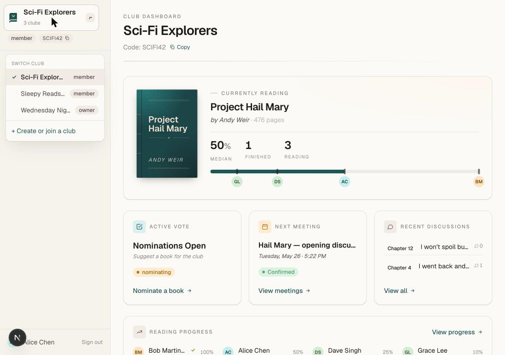
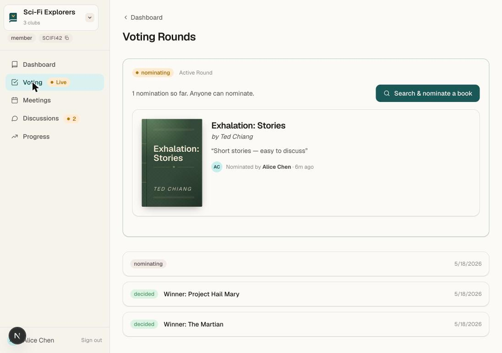
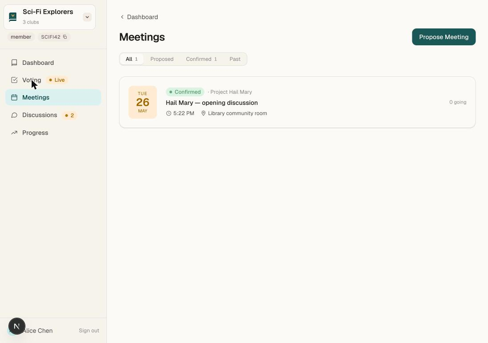
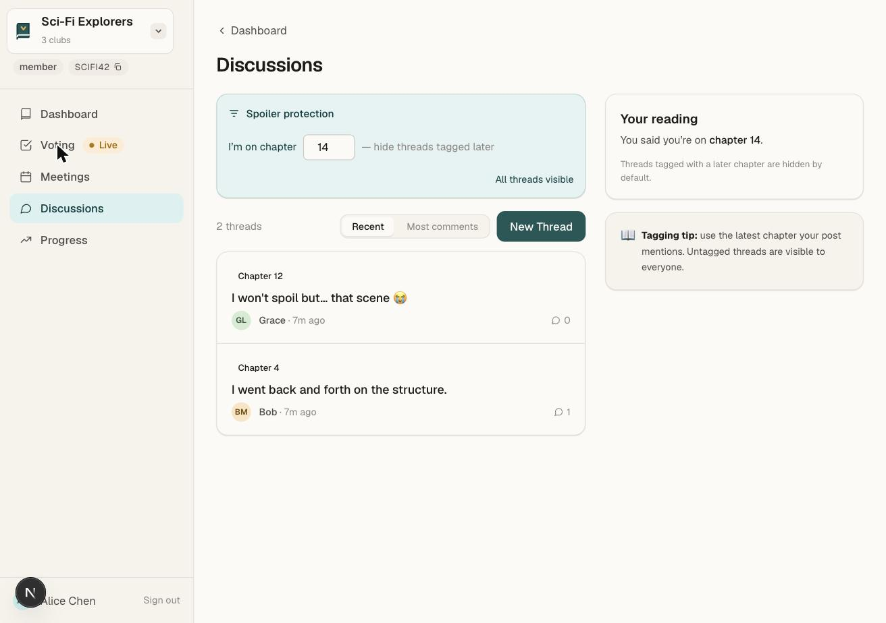
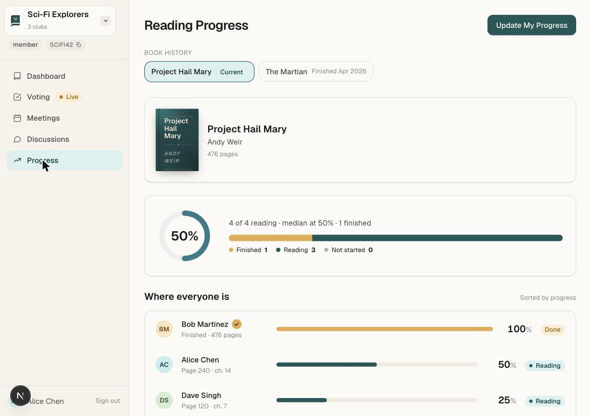

# BookClub Hub

One app for book club coordination — picking books, scheduling meetings, tracking reading, and discussing without spoilers.

## Features

### Clubs
Create or join via a short code. Multi-club switcher in the sidebar.



### Voting
Approval voting across nomination rounds, with hidden tallies until the round closes and automatic tie-break.



### Meetings
Propose time slots, collect availability from members, confirm the best fit.



### Discussions
Chapter-tagged threads with automatic spoiler filtering by reader progress. Comments support reply, edit, and delete (admin moderation).



### Progress
Track pages and chapters per member with a live progress ring, distribution bar, and per-member status.



## Stack

Next.js 16 (App Router) · React 19 · tRPC v11 · PostgreSQL + Prisma 6 · Tailwind 4 · Vitest + Playwright · passwordless email sessions.

## Quick Start

```bash
npm install
make up    # provision DB, seed test data, run dev on :3000
make test  # unit + integration + E2E
make help  # all commands
```

Requirements live in `docs/specs/` (EARS format), low-level designs in `docs/llds/`, linked back to code via `@spec` annotations.
