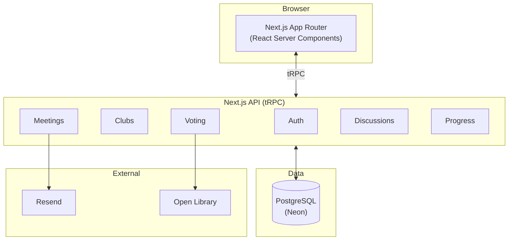
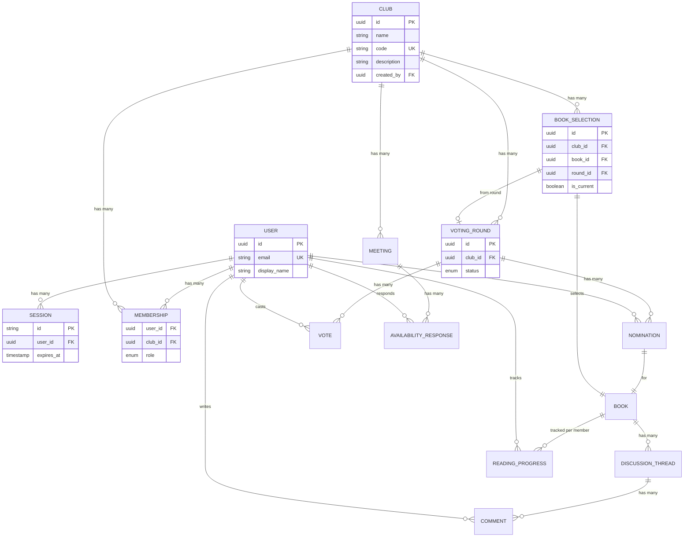
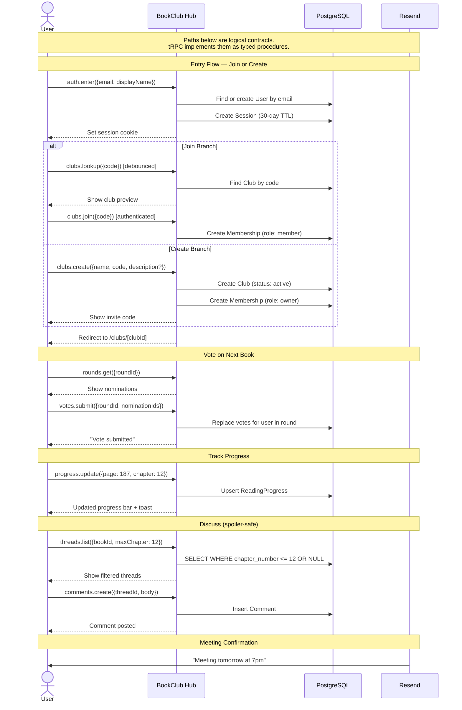

# High-Level Design: BookClub Hub

## Problem

People who participate in book clubs have no single tool that handles the full lifecycle of club activity — selecting books, scheduling meetings, tracking progress, and discussing what they read. Instead, members scatter their coordination across group chats (WhatsApp, iMessage), scheduling tools (Google Calendar, Doodle), spreadsheets (book voting), and forums (Goodreads, Reddit). This fragmentation causes three concrete problems:

1. **Context is lost across tools.** A voting thread in a group chat scrolls away. Meeting times negotiated over email have no connection to the book being discussed. Progress updates go into a different app entirely.
2. **Multi-club members suffer most.** A person in three book clubs juggles three separate sets of tools, three naming conventions, and three notification streams. There is no unified view of "my book clubs."
3. **Coordination tax kills clubs.** The most common failure mode of a book club is not disagreement about books — it is the organizer burning out on logistics. Every meeting requires a manual poll, a manual calendar event, and a manual reminder.

The timing is straightforward: book clubs surged during and after the pandemic, and the tools people adopted were general-purpose communication tools, not purpose-built. The gap between what those tools can do and what a book club actually needs is where this project lives.

## Approach

BookClub Hub eliminates the organizer's coordination burden so that running a book club takes less effort than participating in one. One app replaces the group chat polls, shared spreadsheets, and scheduling threads. A member types a club code, enters their email, and they're in — no sign-up, no password, no OAuth consent screen.

The app is organized around five capabilities, each designed to reduce a specific friction point:

### Club Management (multi-tenancy)

Each club is an isolated space with its own members, books, meetings, and discussions. Users who belong to multiple clubs switch between them via a persistent sidebar. Joining requires only a club code and an email address.

### Book Selection and Voting

Members nominate books and the group votes using approval voting (check every book you'd be happy reading). The organizer can also skip the vote and pick directly. The winning book becomes the club's current read.

### Meeting Scheduling

The organizer proposes 2–5 time slots. Members mark each as available, maybe, or unavailable. The organizer confirms the best fit. One flow replaces the Doodle-in-a-group-chat pattern.

### Discussion Threads

Each book has a threaded discussion space. Threads are tagged by chapter — members only see threads up to the chapter they've reached. Conversations appear as you read, not before.

### Reading Progress Tracking

Members report their page or chapter. A club dashboard shows where everyone is, so the organizer knows when the group is ready to meet without asking.

## Target Users

**Club Organizer** — the person who creates the club, picks dates, and nudges people along. Needs the logistics burden reduced: one place to run votes, schedule meetings, and see who's keeping up. Power user of every feature.

**Active Member** — participates in discussions, votes on books, tracks their reading, and shows up to meetings. Wants a low-friction way to stay engaged without checking multiple apps. Uses the app weekly.

**Casual Member** — reads the books (sometimes) and attends meetings (sometimes). Needs the app to be simple enough that infrequent use doesn't mean re-learning the interface. Passive consumer of notifications and meeting invites.

**Multi-Club Member** — belongs to 2–5 clubs simultaneously. Needs a unified view that lets them switch context quickly. The club selector and cross-club notification summary are designed for this person.

## Goals

1. **Single-pane coordination.** A club organizer can run a complete book-selection-to-meeting cycle without leaving the app. Falsifiable: zero external tools required for the core loop (nominate, vote, schedule, discuss, track).
2. **Sub-30-second club switch.** A multi-club member can switch from one club's context to another in under 30 seconds, including loading the new club's current state.
3. **Voting completes without reminder chasing.** At least 70% of active members vote before the deadline when the system sends automated reminders (24h before deadline).
4. **Progress visibility reduces scheduling guesswork.** The organizer can see aggregate reading progress before scheduling a meeting. Falsifiable: progress dashboard loads for any club with fewer than 50 members in under 2 seconds.
5. **Spoiler-safe discussions.** A member who is on chapter 3 never sees discussion content tagged for chapter 5+ unless they explicitly opt in.

## v1 Scope

v1 ships a complete, usable product for the core loop: join/create → vote → schedule → read → discuss. Everything below is in. Anything not listed is out.

**In v1:**
- Email-only identity with long-lived sessions (no password, no OAuth)
- 4-step entry flow: identity → path choice (join | create) → branch (join-by-code | create-with-code-derivation) → success
- Club creation with auto-derived codes, joining by code, club switcher
- Three-tier roles (owner, admin, member)
- Book nomination + approval voting (N approvals per member, configurable) with external metadata lookup
- Admin-pick (skip vote) for book selection
- Doodle-style meeting scheduling with 3-state availability and heatmap confirmation view
- Chapter-tagged discussion threads with spoiler filtering and real-time mismatch detection in compose
- One-level comment nesting, Markdown support, inline reply composer
- Reading progress (page/percentage/chapter), club progress dashboard with SVG ring, distribution bar, staggered animations
- Email notifications for: round starts, deadline reminder (24h before), meeting proposed, meeting confirmed, meeting reminder (24h)
- Toast feedback on save actions with undo affordance
- Attention banner on dashboard highlighting immediate actions
- Per-member progress indicators on reading hero card with hover tooltips
- Responsive web (mobile-friendly, not native)

**Post-v1 (explicitly deferred):**
- Email verification / magic link upgrade
- Push notifications
- Calendar export (.ics) and external calendar integration
- Recurring meeting templates
- Thread reactions, full-text search, edit history
- Audiobook progress tracking
- Reading pace analytics
- Account deletion (GDPR)
- Per-club display names
- Nomination limits per member

## Non-Goals

- **Public discovery / club marketplace.** There is no browse-clubs page. Clubs are private; you join via code. Discovery is a different product.
- **E-commerce / book purchasing.** The app does not sell books, link to affiliate stores, or integrate with booksellers. Members buy books however they want.
- **E-reader integration.** Progress is entered manually (page number or percentage). There is no Kindle/Kobo/Apple Books sync. That is a feature with high integration cost and low reliability.
- **Video/audio chat.** Meetings are scheduled here but held elsewhere (Zoom, in person, etc.). Building video into a book-club app is not justified.
- **AI-generated discussion prompts or summaries.** The value of a book club is human discussion. Automated prompts are out of scope.
- **Mobile-native apps (v1).** The first version is a responsive web application. Native iOS/Android apps are a future consideration, not a v1 deliverable.

## System Design

### Architecture Overview

### Entity Relationship Overview

### Tech Stack

- **Frontend**: Next.js 15 (React, App Router, Server Components)
- **Backend**: Next.js Route Handlers + tRPC for type-safe API calls
- **Database**: PostgreSQL on Neon (serverless Postgres, generous free tier, branching for dev/preview)
- **ORM**: Prisma (type-safe queries, migration management)
- **Auth**: Custom email-based sessions (HttpOnly cookie, server-side session store)
- **Email**: Resend (transactional email API — notifications, reminders)
- **Deployment**: Vercel (zero-config Next.js hosting, serverless functions, edge network)

This is a CRUD-heavy app with lightweight interactivity — Next.js is the fastest path to a working product. Single language (TypeScript) across the entire stack eliminates context-switching. Prisma provides migration management and type-safe database access. Vercel deployment is zero-config for Next.js. The main trade-off is tight coupling between frontend and backend; if a standalone API is needed later, Route Handlers can be extracted into a separate service.

## Key Design Decisions

| Decision | Chosen | Alternatives Considered | Rationale |
|----------|--------|------------------------|-----------|
| Multi-tenancy model | Shared database, `club_id` FK on all club-scoped tables | Separate database per club; schema-per-club | Shared database is simplest for the expected scale (dozens of clubs, not thousands). Schema-per-club adds operational complexity for negligible isolation benefit. |
| Club switching | Client-side context switch (re-fetch data for selected club) | Subdomain per club; URL path prefix per club | Context switch is simplest. Subdomains require DNS wildcards and complicate deployment. Path prefixes pollute the URL structure. |
| Book metadata | External API lookup (Open Library or Google Books) with local cache | User-entered metadata only; pre-loaded database | External API provides cover images, descriptions, and ISBNs without manual entry. Local cache avoids repeated lookups. User can override if the API result is wrong. |
| Voting method | Approval voting (each member approves N books, highest approval wins) | Ranked choice; simple plurality; Condorcet | Approval voting is simplest to implement and understand. Ranked choice is more fair but harder to explain; plurality suffers from vote splitting. |
| Discussion spoiler handling | Chapter/section tags on threads; filter by user's self-reported progress | No spoiler system; global spoiler toggle; AI-based spoiler detection | Tag-based filtering is deterministic and user-controlled. AI detection is unreliable. Global toggle is too coarse. |
| Notification delivery | Email (v1); push notifications deferred | Push-first; in-app only; SMS | Email works without app installation and reaches all users. Push requires service workers and platform setup. In-app only misses casual members. |
| Tech stack | Next.js + PostgreSQL + Prisma on Vercel | SvelteKit + Drizzle; Rails + Hotwire | Single language (TypeScript), fastest to ship, largest ecosystem, zero-config deployment. Trade-off: tight frontend/backend coupling acceptable for this project's scale. |
| Identity | Email + display name, no password or OAuth | OAuth; username/password; magic links; anonymous/cookie-only | Email is the minimum identity that works across devices and clubs. No password means zero credential management. No OAuth means no third-party dependency and no consent screens. |
| Club joining | Club code (short alphanumeric string shared out-of-band) | Invitation links with tokens; email-sent invites; QR codes | A code is the simplest thing to share verbally or in a group chat. No link formatting, no expiration tokens. |
| Real-time updates | Polling with SWR/stale-while-revalidate (v1) | WebSockets; SSE | Polling is simpler to deploy. Real-time is nice-to-have for discussions but not critical for v1. WebSockets can be added later without data model changes. |
| Email provider | Resend | SendGrid; AWS SES; Postmark | Resend has the simplest API, generous free tier (3k emails/month), and first-class Next.js/Vercel integration. Sufficient for v1 notification volume. |

## Success Metrics

| Metric | Target | How to Measure |
|--------|--------|----------------|
| Time to first meeting | < 10 min | Timed E2E test: create club (via entry flow) → 5 members join → run vote → schedule meeting. Clock starts at Step 1 identity entry. |
| Voting completion rate | > 70% of members vote before deadline | `COUNT(votes) / COUNT(memberships)` per round, filtered to rounds with reminders enabled. Measured per-club, averaged across clubs. |
| Club data isolation | Zero cross-club leakage | Automated security test: create 2 clubs, 2 users (each in one club). Assert every API endpoint returns 403 for the non-member. Run in CI on every deploy. |
| Page load (P95) | < 2s on 4G | Lighthouse CI against the club dashboard page with 50 members and 20 books seeded. Run on every deploy. |
| Entry-to-in-club time | < 15 seconds (join), < 30 seconds (create) | Timed E2E tests: (1) join path — unauthenticated user enters email + name + code → lands in club; (2) create path — enters email + name + club name + cadence → lands in new club. Measures the zero-friction identity + multi-path model. |

## Core User Journey

## Risks

| Risk | Likelihood | Impact | Mitigation |
|------|-----------|--------|------------|
| **Email deliverability** — notifications land in spam, members miss votes and meetings | Medium | High | Use Resend (dedicated transactional email with DKIM/SPF). Keep email volume low (only actionable notifications). Add "check spam" guidance on first join. Monitor bounce rates. |
| **Auth abuse** — anyone who knows an email can impersonate a member | Low | Medium | Acceptable for v1 (trusted friend groups). The data is book opinions, not sensitive. Add magic-link verification as a post-v1 upgrade if the user base widens. |
| **Club code squatting** — someone claims common codes (BOOK, READ, CLUB) | Low | Low | Codes are only unique among active clubs. No public directory means no incentive to squat. If it becomes a problem, add a minimum-length requirement or reserved word list. |
| **External book API downtime** — Open Library or Google Books unavailable | Medium | Low | Manual entry fallback is already designed. Cache all lookups locally so repeat searches work offline. The API is a convenience, not a dependency. |
| **Organizer churn** — the one person running the club stops using the app | Medium | High | Design every feature to minimize organizer effort (one-tap meeting confirmation, automated reminders, progress-based scheduling hints). Allow ownership transfer so another member can take over. |
| **Session cookie loss** — user clears cookies or switches browser, loses access | Medium | Medium | Re-entering email restores access to all clubs. No data is lost — only the session. Make the "welcome back" re-entry flow as frictionless as the initial join. |
| **Prisma query limitations** — complex aggregations (progress summaries, vote tallies) hit ORM limits | Low | Medium | Use Prisma's `$queryRaw` for complex SQL when needed. The data model is straightforward CRUD; most queries are simple. Monitor query performance early. |

## Testing Coverage Plan

### Unit Tests
- Voting tally computation (approval count, tie-breaking by nomination timestamp)
- Progress percentage ↔ page number conversion
- Chapter tag parsing ("Chapter 5" → 5, "Part 2" → 2, "Epilogue" → null)
- Club code validation (length, charset, case normalization)
- Email normalization (lowercase, whitespace trim)
- Role permission checks (owner > admin > member)

### Integration Tests (API layer)
- Auth flow: `/auth/enter` creates user + session; same email returns existing user; expired session returns 401
- Club join flow: valid code → membership created; invalid code → 404; already member → idempotent 200
- Voting lifecycle: create round → nominate → advance to voting → submit votes → advance to decided → winner is correct
- Meeting lifecycle: propose → submit availability → confirm → auto-complete after time passes
- Discussion spoiler filter: `max_chapter=5` returns only threads with chapter_number ≤ 5 or null
- Progress upsert: PUT creates if missing, updates if exists; percentage computation is correct

### E2E Tests (critical user journeys)
| Journey | What It Covers |
|---------|----------------|
| New user joins club | Enter code + email + name → lands in club → sees current book and members |
| Voting round | Admin creates round → member nominates → admin advances → member votes → admin decides → winner displayed |
| Meeting scheduling | Admin proposes slots → member submits availability → admin confirms → reminder email sent (mock) |
| Spoiler-safe discussion | Member at Ch. 5 sees only Ch. 1–5 threads → updates progress to Ch. 10 → sees Ch. 6–10 threads appear |
| Multi-club switching | User in 2 clubs → switches → sees correct club data, no bleed |

### Security Tests (run in CI)
- **Cross-club isolation**: User A (member of Club 1 only) cannot GET/POST/PUT/DELETE any endpoint scoped to Club 2. Test every club-scoped route.
- **Session validity**: Expired session cookie → 401. Tampered session ID → 401. No cookie → 401.
- **Input sanitization**: Markdown rendering does not execute `<script>` tags. SQL injection attempts in search/filter params return errors, not data.
- **Club code enumeration**: `/api/clubs/lookup` returns only name and member count, not internal IDs, book data, or member emails.

## References

- `docs/llds/auth-and-accounts.md`
- `docs/llds/club-management.md`
- `docs/llds/book-selection-and-voting.md`
- `docs/llds/meeting-scheduling.md`
- `docs/llds/discussion-threads.md`
- `docs/llds/reading-progress.md`
- `docs/specs/auth-specs.md`
- `docs/specs/club-specs.md`
- `docs/specs/vote-specs.md`
- `docs/specs/meet-specs.md`
- `docs/specs/disc-specs.md`
- `docs/specs/prog-specs.md`
