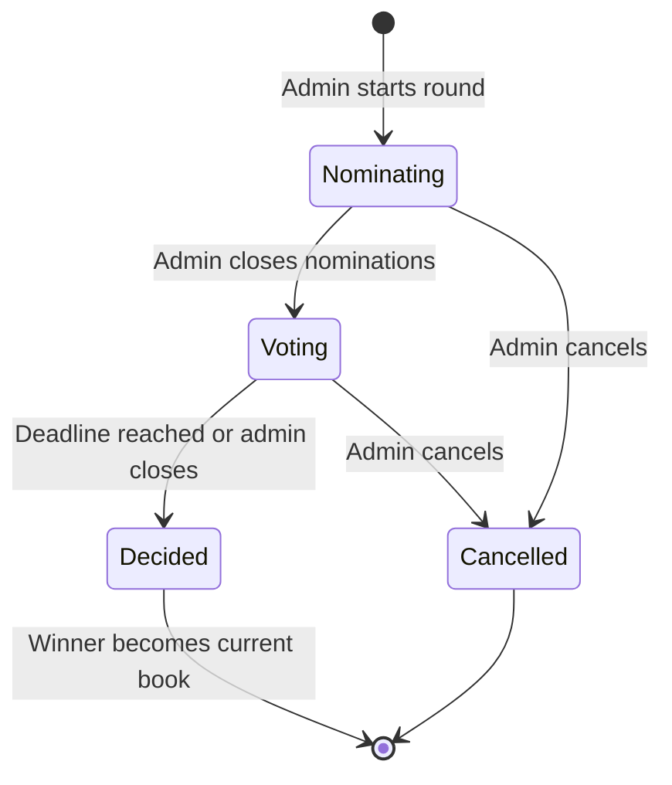

# Book Selection and Voting

## Context and Design Philosophy

Book selection is the core decision-making feature. A club picks its next book through a structured process: members nominate candidates, the group votes, and the winner becomes the current read. This replaces the informal "who wants to read what?" conversation that happens in group chats and produces no clear outcome.

The design philosophy is **structured but not rigid**. The system enforces a nomination/vote cycle but lets the organizer skip steps (e.g., the organizer picks a book without a vote). The voting mechanism is approval voting — simple to understand, resistant to vote splitting, and trivial to implement.

Traces to HLD Approach (Book Selection and Voting) and Key Design Decision (voting method: approval voting).

## Voting Round Lifecycle



- **Nominating**: members add books. No duplicates within the same round. Admin can set a nomination deadline (optional).
- **Voting**: each member approves up to N books (N configurable, default = 3, minimum 1). Admin sets a voting deadline.
- **Decided**: the book with the most approvals wins. Ties are broken by earliest nomination timestamp. Winner is promoted to the club's current book.
- **Cancelled**: round is discarded. Nominations and votes are deleted.

## Data Model

```
Book {
  id: UUID (PK)
  title: string
  author: string
  isbn: string (nullable)
  cover_url: string (nullable)
  description: string (nullable)
  page_count: integer (nullable)
  open_library_id: string (nullable)
  created_at: timestamp
}

VotingRound {
  id: UUID (PK)
  club_id: UUID (FK -> Club)
  status: enum("nominating", "voting", "decided", "cancelled")
  max_approvals_per_member: integer (default 3)
  nomination_deadline: timestamp (nullable)
  voting_deadline: timestamp (nullable)
  winning_book_id: UUID (FK -> Book, nullable)
  created_by: UUID (FK -> User)
  created_at: timestamp
  updated_at: timestamp
}

Nomination {
  id: UUID (PK)
  round_id: UUID (FK -> VotingRound)
  book_id: UUID (FK -> Book)
  nominated_by: UUID (FK -> User)
  pitch: string (max 500 chars, nullable -- "why I want to read this")
  created_at: timestamp
  UNIQUE(round_id, book_id)
}

Vote {
  id: UUID (PK)
  round_id: UUID (FK -> VotingRound)
  nomination_id: UUID (FK -> Nomination)
  user_id: UUID (FK -> User)
  created_at: timestamp
  UNIQUE(round_id, nomination_id, user_id)
}

BookSelection {
  id: UUID (PK)
  club_id: UUID (FK -> Club)
  book_id: UUID (FK -> Book)
  round_id: UUID (FK -> VotingRound, nullable -- null if admin-picked)
  selected_at: timestamp
  finished_at: timestamp (nullable)
  is_current: boolean (default true)
}
```

## Book Metadata Lookup

When a member nominates a book, they can search by title or ISBN. The system queries the Open Library API and presents results. The member selects the correct edition. Metadata (title, author, cover, page count) is cached locally in the Book table via Prisma.

If the API is unavailable, the member can enter metadata manually. The API is a convenience, not a dependency.

See `docs/design-system.md` → Components → Book Cover and the design artboards for the visual implementation of book search, selection, and nomination flow.

## Voting Interaction

Vote tallies are hidden until the voting phase ends (to prevent bandwagoning). After the round is decided, results are visible to all members. For visual details on the voting UI and member approval checkboxes, see the design artboards at `docs/bookclub-hub-designs/project/artboards/voting.jsx`.

## API Contracts

Endpoints below are logical contracts. The implementation uses tRPC procedures (e.g., `rounds.create(...)`, `votes.submit(...)`) rather than REST routes.

| Procedure | Auth | Input | Output |
|-----------|------|-------|--------|
| `rounds.list` | member | `{ clubId }` | `[{ round }]` |
| `rounds.create` | admin+ | `{ clubId, max_approvals?, nomination_deadline?, voting_deadline? }` | `{ round }` |
| `rounds.get` | member | `{ roundId }` | `{ round, nominations, votes? }` (votes only if decided or own votes) |
| `rounds.advance` | admin+ | `{ roundId }` | (nominating→voting or voting→decided) |
| `rounds.cancel` | admin+ | `{ roundId }` | - |
| `nominations.create` | member | `{ roundId, book_id, pitch? }` | `{ nomination }` |
| `nominations.delete` | author or admin+ | `{ nominationId }` | - |
| `votes.submit` | member | `{ roundId, nomination_ids }` | (replaces all votes for user in round) |
| `books.search` | required | `{ query }` | `[{ book }]` (from Open Library API + local cache) |
| `selections.list` | member | `{ clubId }` | `[{ selection }]` (reading history) |

## Notification Triggers (via Resend)

- Round enters "nominating": email all club members
- Round enters "voting": email all club members
- Voting deadline approaching (24h before): email members who haven't voted
- Round decided: email all club members with the winner

## Decisions & Alternatives

| Decision | Chosen | Alternatives Considered | Rationale |
|----------|--------|------------------------|-----------|
| Voting method | Approval voting | Ranked choice; plurality; Borda count | Approval is simplest to implement and explain. A member checks the books they'd be happy reading. Highest count wins. Ranked choice is theoretically more fair but the UI and tallying are significantly more complex for a book club. |
| Vote visibility during voting | Hidden until decided | Live tally; anonymous results | Hidden tallies prevent bandwagoning ("everyone's voting for X so I will too"). Encourages genuine preference expression. |
| Tie-breaking | Earliest nomination timestamp | Random; admin picks; runoff | Earliest nomination rewards initiative and is deterministic. Random feels arbitrary. Runoff extends the process unnecessarily. |
| Vote replacement | Full replacement (submit all approvals at once) | Incremental add/remove | Full replacement is simpler and avoids partial-vote states. The member submits their complete preference in one action. |
| Admin override (pick without vote) | Allowed via direct BookSelection creation | Not allowed; must always vote | Sometimes the organizer just knows what the club should read. Forcing a vote in every case is bureaucratic. |

## Open Questions & Future Decisions

### Resolved

1. ✅ Approval voting with hidden tallies.
2. ✅ External book metadata API with manual fallback.
3. ✅ Tie-breaking by earliest nomination.

### Deferred

1. **Nomination limits per member per round.** Currently unlimited. May need a cap if lists get unwieldy.
2. **Reading history analytics.** Genre distribution, pace over time, author diversity. Interesting but not v1.
3. **"I've already read this" flag.** A member could flag a nomination as already-read. Useful signal but adds UI complexity.

## Design Reference

**Visual implementation:** See `docs/bookclub-hub-designs/project/artboards/voting.jsx` (three interactive phases: Nominating, Voting, Decided).

**Design tokens & components:**
- Book covers: `BookCover` component with six color variants (`cv-teal`, `cv-rust`, `cv-sage`, `cv-mauve`, `cv-amber`, `cv-ink`)
- Status badges: `Badge` with tones (e.g., `tone="primary"` for Nominating phase)
- Checkboxes: custom styled with primary teal on checked state
- Progress indicators: show vote count / total members (secondary ink color)
- Card layout: each nomination in a card with 20px padding, `--shadow-sm` elevation
- Buttons: `btn-primary` for submit/confirm actions, `btn-secondary` for fallback options

**Key patterns:**
- **Nomination phase UI:**
  - Book search with Open Library results in a scrollable list
  - Manual entry fallback with title/author inputs
  - Pitch textarea (optional, max 500 chars)
  
- **Voting phase UI:**
  - Checkboxes for approval selection (up to N per member)
  - Show approval count vs. max allowed
  - Vote tallies hidden until phase ends (prevent bandwagoning)
  - Timestamp metadata for nominator and deadline

- **Decided phase UI:**
  - Winner highlighted with `Badge tone="success"` and `I.check` icon
  - Full vote breakdown visible
  - Tie-breaking note (earliest nomination) if applicable
  - "Next Book" card transitions to current book

**Typography & spacing:**
- Nomination title: Title class (20px serif, 600 weight)
- Nominator name: Caption class (12px, secondary ink)
- Pitch text: Body class (15px, 1.55 line-height)
- Phase indicator: Badge at top (12px, bold, primary tone)

## References

- `docs/high-level-design.md`
- `docs/llds/club-management.md` — rounds are scoped to clubs
- `docs/specs/vote-specs.md`
- `docs/design-system.md` — design tokens, BookCover component, Badge variants
