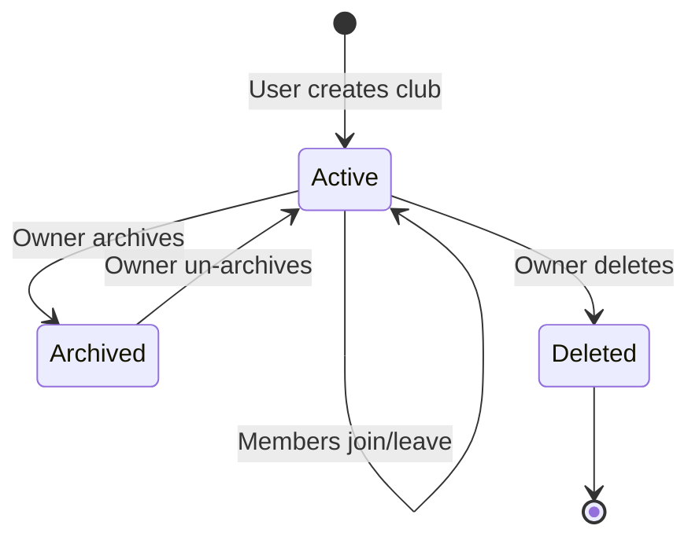

# Club Management

## Context and Design Philosophy

Club management is the multi-tenancy backbone. Every other feature (voting, meetings, discussions, progress) is scoped to a club. This LLD defines how clubs are created, how members join via club codes, how roles work, and how the user switches between clubs.

The guiding principle is **isolation by default**: a user sees nothing from a club they don't belong to. There is no global feed, no cross-club search, no public directory. Clubs are private spaces, discoverable only by knowing the club code.

Traces to the HLD's Approach section (Club Management), the Multi-Tenancy key design decision, the Club Joining key design decision, and the Non-Goal (no public discovery).

## Club Codes

Every club has a **club code** — a short, human-readable, alphanumeric string (e.g., `DUNE42`, `WEDREADS`, `SCIFI99`). The code is the only way to join a club. It is set by the organizer at club creation and can be changed later.

Codes are case-insensitive (stored uppercase), 4–16 characters, letters and digits only. They must be unique across all active clubs. The organizer shares the code in their group chat, and members type it into the app.

Why codes over invitation links: a code is the simplest thing to share verbally, in a text message, or on a whiteboard. No URL formatting, no broken links, no expiration tokens. "Join code: DUNE42" is all you need.

## Membership Roles

Three roles, each a strict superset of the one below:

- **owner** — created the club. Can delete the club, transfer ownership, change the club code, and do everything an admin can do. Exactly one owner per club.
- **admin** — can manage members (remove, promote to admin), edit club settings (name, description), and manage voting rounds. Cannot delete the club or transfer ownership.
- **member** — can nominate books, vote, RSVP to meetings, post in discussions, and track progress. Cannot manage other members or club settings.

## Club Lifecycle



- **Active**: normal operation. All features available. New members can join via code.
- **Archived**: read-only. History visible, no new votes/meetings/discussions. Code is deactivated (cannot join). Owner can un-archive.
- **Deleted**: soft-delete. Data retained for 30 days, then hard-deleted. Not recoverable by the user after soft-delete.

## Data Model

```
Club {
  id: UUID (PK)
  name: string (max 100 chars)
  description: string (max 500 chars, nullable)
  code: string (unique, uppercase, 4-16 chars, alphanumeric)
  created_by: UUID (FK -> User)
  status: enum("active", "archived", "deleted")
  deleted_at: timestamp (nullable)
  created_at: timestamp
  updated_at: timestamp
}

Membership {
  id: UUID (PK)
  club_id: UUID (FK -> Club)
  user_id: UUID (FK -> User)
  role: enum("owner", "admin", "member")
  joined_at: timestamp
  UNIQUE(club_id, user_id)
}
```

No Invitation table. The club code on the Club record is the only join mechanism.

## Join Flow

### Already Logged In

1. User enters club code on the join page
2. Server looks up club by code (case-insensitive)
3. If club not found or not active: error
4. If user is already a member: redirect to club
5. If valid: create Membership (role: member), redirect to club

### Not Logged In

1. User enters club code + email + display name on a combined join page
2. Server finds or creates User by email
3. Server looks up club by code
4. If valid: create Membership, create session, redirect to club

This means a brand-new user can go from zero to inside a club in a single form submission.

```
┌──────────────────────────────────────────┐
│  Join a Book Club                        │
│                                          │
│  Club code: [DUNE42______]               │
│  Email:     [evan@example.com]           │
│  Name:      [Evan___________]            │
│                                          │
│  [Join]                                  │
│                                          │
│  Already in clubs? [Go to my clubs →]    │
└──────────────────────────────────────────┘
```

## Club Creation

1. User (must be logged in) clicks "Create a club"
2. Enters: club name, description (optional), club code (with uniqueness check)
3. Server creates Club, creates Membership (role: owner)
4. User lands in the new (empty) club

```
┌──────────────────────────────────────────┐
│  Create a Book Club                      │
│                                          │
│  Name:        [Wednesday Night Reads__]  │
│  Description: [We read sci-fi and____]   │
│  Club code:   [WEDREADS__]  ✓ Available  │
│                                          │
│  Share this code with your group so      │
│  they can join.                          │
│                                          │
│  [Create Club]                           │
└──────────────────────────────────────────┘
```

## Club Switcher

The club switcher is a persistent UI element (sidebar on desktop, bottom sheet on mobile) visible on every authenticated page.

```
┌──────┬──────────────────────────────────┐
│ Clubs│  Wednesday Night Reads           │
│      │  ┌────────────────────────────┐  │
│ [WN] │  │ Currently reading: Dune    │  │
│ ●    │  │ Next meeting: May 15       │  │
│      │  │ Your progress: 45%         │  │
│ [SF] │  └────────────────────────────┘  │
│      │                                  │
│ [HR] │  [Discussions] [Vote] [Meetings] │
│      │                                  │
│ [+]  │  ...                             │
└──────┴──────────────────────────────────┘

● = unread activity indicator
[+] = create new club or join with code
```

Switching clubs is a client-side operation: the app fetches the target club's current state (current book, upcoming meeting, user's progress) and re-renders. No page reload. Target: under 30 seconds per the HLD goal.

## API Endpoints

| Endpoint | Method | Auth | Request | Response |
|----------|--------|------|---------|----------|
| `/api/clubs` | GET | required | - | 200 `[{ club, role, current_book, unread_count }]` |
| `/api/clubs` | POST | required | `{ name, description, code }` | 201 `{ club }` (creator becomes owner) |
| `/api/clubs/:id` | GET | member | - | 200 `{ club, members, current_book }` |
| `/api/clubs/:id` | PATCH | admin+ | `{ name?, description?, code? }` | 200 `{ club }` |
| `/api/clubs/:id` | DELETE | owner | - | 200 (soft delete) |
| `/api/clubs/:id/members` | GET | member | - | 200 `[{ user, role, joined_at }]` |
| `/api/clubs/:id/members/:userId` | DELETE | admin+ (or self) | - | 200 |
| `/api/clubs/:id/members/:userId/role` | PATCH | owner | `{ role }` | 200 |
| `/api/clubs/join` | POST | optional | `{ code, email?, display_name? }` | 200 `{ club }` (creates session if not logged in) |
| `/api/clubs/lookup` | GET | - | `?code=...` | 200 `{ club_name, member_count }` or 404 |

The `/api/clubs/lookup` endpoint is unauthenticated — it lets the join form show the club name before the user submits. It returns minimal info (name, member count) to avoid leaking club data.

## Authorization Model

All club-scoped API endpoints check membership before processing. The check is: "does a Membership record exist for (request.user_id, :club_id) and is the role sufficient?"

| Action | Required Role |
|--------|--------------|
| View club data | member+ |
| Edit club settings | admin+ |
| Change club code | owner |
| Manage members (remove, promote) | admin+ |
| Delete club | owner |
| Transfer ownership | owner |
| Leave club | member+ (owner cannot leave without transferring) |

## Decisions & Alternatives

| Decision | Chosen | Alternatives Considered | Rationale |
|----------|--------|------------------------|-----------|
| Join mechanism | Club code (short alphanumeric) | Shareable invitation links; email-sent invites; QR codes | Club code is the simplest thing to share in a group chat or say out loud. No URL formatting, no tokens, no expiration. "Join code: DUNE42" is all you need. |
| Code format | 4–16 chars, alphanumeric, case-insensitive | UUID-based; numeric-only; auto-generated | Human-chosen codes are memorable and shareable. Auto-generated codes are harder to remember. Numeric-only is too collision-prone in short lengths. |
| Code uniqueness | Unique across active clubs | Globally unique (including deleted); no uniqueness (password-style) | Active-only uniqueness recycles codes from deleted clubs. Global uniqueness would exhaust short codes over time. No uniqueness requires a club ID + code combo, which is more friction. |
| Role model | Three roles (owner, admin, member) | Two roles (owner, member); fine-grained permissions | Three roles is the minimum that covers the use cases. Fine-grained permissions add UI complexity without clear benefit. |
| Club deletion | Soft delete with 30-day retention | Hard delete immediately; archive-only (no delete) | Soft delete prevents accidental data loss. 30-day retention bounds storage. Archive-only doesn't respect the user's intent to remove. |

## Open Questions & Future Decisions

### Resolved

1. ✅ Club codes as join mechanism (not invitation links).
2. ✅ Three-tier role model.
3. ✅ Soft delete with 30-day retention.

### Deferred

1. **Club settings beyond name/description.** Timezone, default voting method, notification preferences. These will emerge as other features crystallize.
2. **Member limit per club.** No hard cap in v1.
3. **Ownership transfer UX.** The API supports it; the UI flow is deferred to implementation.
4. **Code regeneration rate limiting.** Prevent an owner from burning through codes. Not urgent for v1 scale.

## References

- `docs/high-level-design.md`
- `docs/llds/auth-and-accounts.md` — identity provides the user that membership references
- `docs/specs/club-specs.md`
