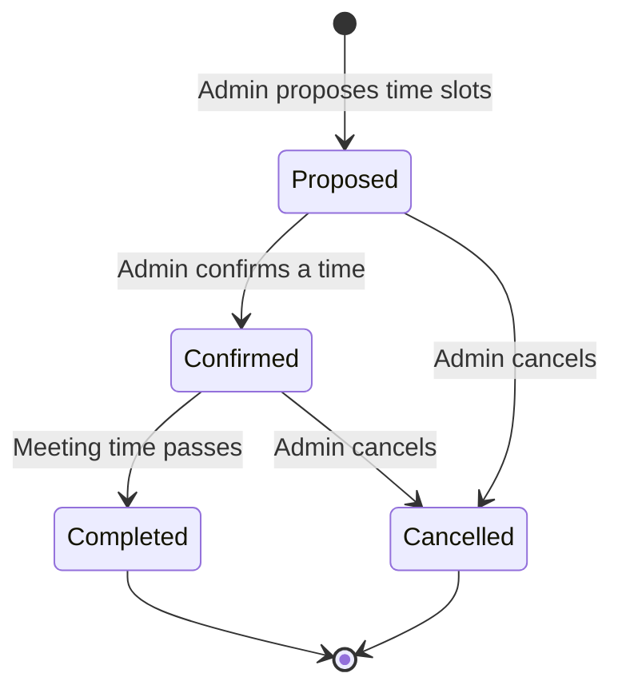

# Meeting Scheduling

## Context and Design Philosophy

Meetings are where the book club actually meets. Scheduling is the second-highest-friction activity after book selection (the first being "when can everyone meet?"). This LLD replaces the Doodle-poll-in-a-group-chat pattern with an integrated availability poll tied to the club's current book.

Design philosophy: **lightweight scheduling, not a calendar app**. The system proposes times, collects availability, and confirms a meeting. It does not manage recurring schedules, integrate with external calendars (v1), or handle time zones beyond displaying them correctly.

Traces to HLD Approach (Meeting Scheduling) and Success Metric (voting completes without reminder chasing — meetings inherit the same reminder infrastructure).

## Meeting Lifecycle



- **Proposed**: admin offers 2–5 candidate time slots. Members indicate availability for each.
- **Confirmed**: admin picks a time based on availability responses. The meeting is set.
- **Completed**: the meeting's scheduled time has passed. Automatic transition.
- **Cancelled**: admin cancels. Members are notified.

## Data Model

```
Meeting {
  id: UUID (PK)
  club_id: UUID (FK -> Club)
  book_id: UUID (FK -> Book, nullable -- nullable for non-book meetings)
  title: string (default: "Meeting: {book title}")
  description: string (nullable)
  status: enum("proposed", "confirmed", "completed", "cancelled")
  confirmed_time: timestamp (nullable -- set when confirmed)
  location: string (nullable -- "Zoom link", "Alice's house", etc.)
  created_by: UUID (FK -> User)
  created_at: timestamp
  updated_at: timestamp
}

MeetingTimeSlot {
  id: UUID (PK)
  meeting_id: UUID (FK -> Meeting)
  proposed_time: timestamp
  duration_minutes: integer (default 60)
}

AvailabilityResponse {
  id: UUID (PK)
  slot_id: UUID (FK -> MeetingTimeSlot)
  user_id: UUID (FK -> User)
  status: enum("available", "maybe", "unavailable")
  created_at: timestamp
  UNIQUE(slot_id, user_id)
}
```

## Availability Collection UI

```
┌─────────────────────────────────────────────────┐
│  Schedule Meeting: Dune Discussion              │
│  Proposed by Alice                              │
│                                                 │
│  Mark your availability:                        │
│                                                 │
│  ┌───────────────────┬─────┬───────┬─────────┐  │
│  │ Time              │ ✓   │ Maybe │ ✗       │  │
│  ├───────────────────┼─────┼───────┼─────────┤  │
│  │ Mon May 18, 7pm   │ (●) │ ( )   │ ( )     │  │
│  │ Wed May 20, 8pm   │ ( ) │ (●)   │ ( )     │  │
│  │ Sat May 23, 2pm   │ (●) │ ( )   │ ( )     │  │
│  └───────────────────┴─────┴───────┴─────────┘  │
│                                                 │
│  5 of 8 members have responded                  │
│  [Submit]                                       │
│                                                 │
│  ── Responses (admin view) ──                   │
│  Mon 18: ✓✓✓✓ ~✗✗                               │
│  Wed 20: ✓✓ ~~✗✗✗                               │
│  Sat 23: ✓✓✓✓✓ ~                                │
│           ↑ best fit                            │
│                                                 │
│  [Confirm Sat May 23, 2pm]                      │
└─────────────────────────────────────────────────┘
```

## API Endpoints

| Endpoint | Method | Auth | Request | Response |
|----------|--------|------|---------|----------|
| `/api/clubs/:clubId/meetings` | GET | member | `?status=...` | 200 `[{ meeting, slots, responses_summary }]` |
| `/api/clubs/:clubId/meetings` | POST | admin+ | `{ title?, book_id?, description?, location?, slots: [{ time, duration? }] }` | 201 `{ meeting, slots }` |
| `/api/clubs/:clubId/meetings/:meetId` | GET | member | - | 200 `{ meeting, slots, responses }` |
| `/api/clubs/:clubId/meetings/:meetId` | PATCH | admin+ | `{ title?, description?, location? }` | 200 |
| `/api/clubs/:clubId/meetings/:meetId/confirm` | POST | admin+ | `{ slot_id }` | 200 `{ meeting }` (sets confirmed_time) |
| `/api/clubs/:clubId/meetings/:meetId/cancel` | POST | admin+ | - | 200 |
| `/api/clubs/:clubId/meetings/:meetId/availability` | POST | member | `{ responses: [{ slot_id, status }] }` | 200 (replaces all responses for this user) |

## Notification Triggers

- Meeting proposed: notify all club members
- Availability not yet submitted (48h after proposal): remind non-responders
- Meeting confirmed: notify all members with time, location, and book
- Meeting reminder: 24 hours before confirmed time
- Meeting cancelled: notify all members

## Time Zone Handling

All timestamps are stored in UTC. The frontend displays times in the user's local timezone (detected from browser). The proposal UI lets the admin enter times in their local timezone; the server converts to UTC on receipt. No per-user timezone setting in v1.

## Decisions & Alternatives

| Decision | Chosen | Alternatives Considered | Rationale |
|----------|--------|------------------------|-----------|
| Scheduling model | Propose-and-respond (Doodle-style) | Fixed recurring schedule; calendar integration; free-text poll | Propose-and-respond is the proven pattern for small-group scheduling. Recurring schedules are too rigid for irregular book clubs. Calendar integration is high-effort for v1. |
| Availability options | Three-state (available, maybe, unavailable) | Binary (yes/no); four-state (adding "prefer") | Three states capture useful nuance. Binary loses the "maybe" signal. Four states add complexity without much information gain. |
| Who confirms the time | Admin picks from responses | Auto-confirm best fit; group vote on time | Admin picks because they know context the algorithm doesn't (e.g., "we always meet at Alice's house on Saturdays"). |
| Meeting-book linkage | Optional FK to Book | Required; no linkage | Optional because clubs may have non-book meetings (planning, social). |

## Open Questions & Future Decisions

### Resolved

1. ✅ Doodle-style propose-and-respond.
2. ✅ Three-state availability.
3. ✅ Admin confirms.

### Deferred

1. **Calendar export (.ics).** Confirmed meetings should be exportable as .ics files. Straightforward but not v1 core.
2. **Recurring meeting templates.** "We usually meet the third Thursday" — a template that pre-fills time slots.
3. **External calendar integration (Google Calendar, Outlook).** Two-way sync is complex. Deferred.

## References

- `docs/high-level-design.md`
- `docs/llds/club-management.md` — meetings are club-scoped
- `docs/llds/book-selection-and-voting.md` — meetings link to books
- `docs/specs/meet-specs.md`
